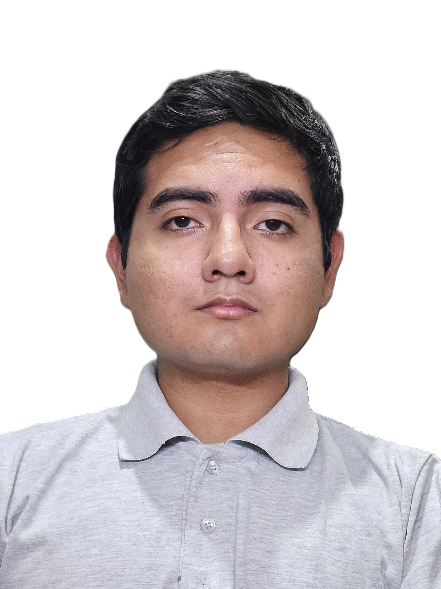
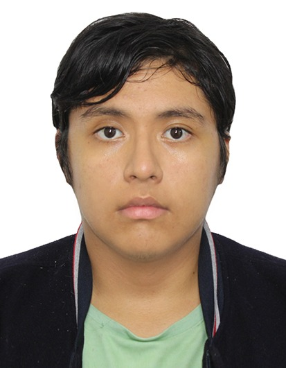

# Capítulo 1: Introducción

La introducción cumple con un rol fundamental para estructurar y comprender el proyecto
realizado, debido a que establece el marco conceptual y contextual donde se va a desarrollar 
el trabajo. En esta sección, se presenta una vista general que permite al lector 
comprender los objetivos principales que se desean alcanzar, tales como antecedentes que
derivaron a la formulación del proyecto. Además, se delimita el alcance del mismo, es decir,
hasta dónde se pretende llegar con el desarrollo de la propuesta. Asimismo, la introducción 
cumple la función de poner en contexto la importancia del proyecto en un entorno específico, 
donde se destacan las razones que justifican el porqué de su desarrollo, los retos que se  
pretenden abordar y los beneficios esperados a partir de la implementación. Por último, esta parte 
inicial no solo informa, sino que también orienta y motiva al lector a profundizar en el contenido 
que se presentará a lo largo del documento.

## 1.1 Startup Profilee

### 1.1.1 Descripción de la Startup

### **Misión**

### **Visión**

### 1.2.3 Perfiles de Integrantes del Equipo

|                         Foto                         |                                Detalles del Perfil                                 |                                                                                    Descripción Personal                                                                                    |
|:----------------------------------------------------:|:----------------------------------------------------------------------------------:|:------------------------------------------------------------------------------------------------------------------------------------------------------------------------------------------:|
|    |   Marcelo Martín Angulo Ramírez   (U202321425)   Ingeniería de Software.   | Tengo 21 años y soy una persona puntual, responsable y comunicativa. Me interesé por la carrera gracias a cursos de programación del colegio y a los que tomé por mi cuenta; actualmente manejo C++ y Python, y busco ampliar mis conocimientos en otros lenguajes para optimizar mi trabajo en equipo y resolver problemas. |
|  |    Cobades Zamora Yhoshua Hebert   (U20231H117)   Ingeniería de Software.    |  |
|    |  Flores Martinez Ricardo Andres   (U202423162)   Ingeniería de Software.   |  |
|      |    Nestor Daniel Rojas Ambicho   (U20241F397)   Ingeniería de Software.    | Tengo 20 años, apasionado por la tecnología, el desarrollo de aplicaciones y la programación. Con experiencia en proyectos académicos de software, bases de datos y metodologías de desarrollo, busco constantemente aprender y dominar nuevas herramientas técnicas. Me interesé por la carrera debido a que desde el colegio me gustaban cursos relacionados a la tecnologia, y después empecé a aprender por mi cuenta. |
|  | Rodolfo Martin Zavaleta Gutierrez   (U20241F733)   Ingeniería de Software. | Tengo 19 años y soy una persona puntual y responsable. Me interesé por la carrera debido a mis gustos adquiridos por la programación gracias a cursos del colegio y que tomé por mi parte. |